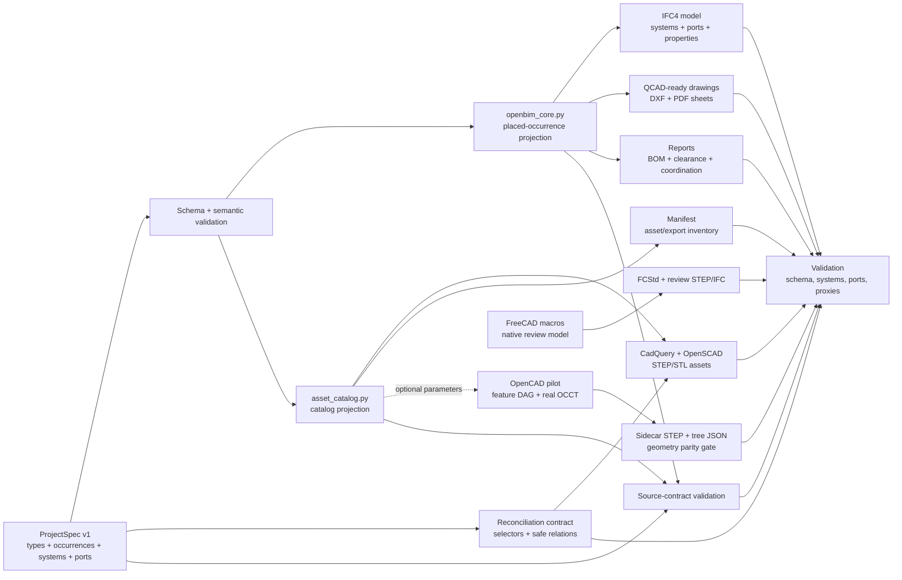

# CoordProof

**Reproducible OpenBIM evidence package for MEP coordination.**

[](https://github.com/Taz33m/coordproof-openbim-mep/actions/workflows/ci.yml)
[](https://github.com/Taz33m/coordproof-openbim-mep/actions/workflows/codeql.yml)
[](LICENSE)
[](CONTRIBUTING.md)

CoordProof generates a coordinated mechanical-room package from reviewed Python/OpenBIM source definitions. The package includes IFC4 semantics, FreeCAD review models, QCAD DXF/PDF drawings, STEP/STL CAD exports, asset manifests, BOM/clearance reports, and automated validation.

<p align="center">
  <a href="https://youtu.be/4Ww1gH0GFy8">
    
  </a>
</p>

<p align="center">
  <a href="https://taz33m.github.io/coordproof-openbim-mep/">Project page</a> ·
  <a href="https://youtu.be/4Ww1gH0GFy8">Video overview</a>
</p>

## System

CoordProof models a mechanical room as a traceable CAD/BIM production package.
The versioned [`spec/mechanical_room.project.json`](spec/mechanical_room.project.json)
is the authoritative project contract for reusable asset types, placed
occurrences, deliverable artifacts, systems, ports, connections, and required
coverage. [`spec/project.schema.json`](spec/project.schema.json) and semantic
validation in [`tools/project_spec.py`](tools/project_spec.py) reject invalid or
dangling declarations before generators run. Python consumers expose compatible
catalog and IFC schedule projections while geometry remains implemented in the
reviewed CadQuery, OpenSCAD, FreeCAD, and drawing generators.

The versioned [`spec/reconciliation.contract.json`](spec/reconciliation.contract.json)
binds authoritative numeric values to producer inputs without copying expected
values. CadQuery and OpenSCAD currently reconcile 75/75 canonical engineering
parameters and account for 78/78 observed top-level numeric inputs. The three
additional inputs are explicit OpenSCAD `$fn` facet-control exclusions, not
engineering dimensions. Declared type-to-occurrence differences must be equal,
safely derived, or a justified override.

Reconciliation v1 verifies declared fallback values and the bounded plumbing
that forwards ProjectSpec inputs into CadQuery or OpenSCAD. Differential tests
also confirm that every current numeric CadQuery input changes generated
geometry. These checks are not a dimensional inspection of committed STEP/STL
files; observed-export parity remains a separate roadmap milestone.

The package connects geometry, drawings, IFC semantics, reports, and QA outputs as inspectable artifacts.


## Visual Outputs

| 3D coordination review | Drawing package | OpenBIM validation |
| --- | --- | --- |
|  |  |  |

| Section + IFC connectivity | BIM hierarchy | Asset/export coverage |
| --- | --- | --- |
|  |  |  |

## Evidence Summary

| Output | Count | Purpose |
| --- | ---: | --- |
| IFC models | 2 | Authoritative semantic IFC plus supporting FreeCAD review export. |
| IFC products | 43 | Named BIM objects in the authoritative IFC model. |
| Distribution systems | 5 | CHWS, CHWR, supply air, return air, and electrical routing. |
| Distribution ports | 51 | MEP connectivity graph. |
| Connected port pairs | 22 | Machine-readable relationships between systems/assets. |
| Building element proxies | 0 | No generic proxy fallback in the authoritative validation model. |
| Manifest assets | 56 | Traceable asset and evidence inventory across 15 categories. |
| DXF/PDF sheets | 7 + 7 | QCAD drawing package and review exports. |
| STEP/STL exports | 10 + 13 | Reusable CAD assets and mesh review/export layer. |
| Canonical engineering parameters | 75 / 75 | Default/input bindings reconciled across the required CadQuery/OpenSCAD producers. |
| Observed producer numeric inputs | 78 / 78 | Accounted for: 75 mapped values and 3 explicit OpenSCAD `$fn` technical exclusions. |
| Reconciliation relations | 17 | Equal, safely derived, or justified type-to-occurrence relationships. |
| Critical validation failures | 0 | Current automated QA status. |

## Generated Package

| Package Layer | Generated Artifacts |
| --- | --- |
| OpenBIM model | IFC4 project/site/building/storey/space hierarchy, MEP classes, systems, ports, property sets, and semantic inventory. |
| CAD review model | FreeCAD assembly files and supporting FreeCAD BIM organization for native model inspection. |
| Drawing package | QCAD-ready DXF sheets with matching PDF exports, title blocks, dimensions, sections, details, and system routing views. |
| Asset library | CadQuery and OpenSCAD assets exported to STEP/STL for reusable mechanical supports, routing components, bases, sleeves, and details. |
| Reports | Coordination report, bill of materials, clash/clearance screen, parameter reconciliation evidence, IFC entity summary, and validation report. |
| QA manifest | Asset manifest and export index linking generated objects to categories, parameters, file outputs, and validation status. |

## Architecture



The authority and migration boundary are recorded in
[ADR 0002](docs/decisions/0002-versioned-projectspec.md); the optional OpenCAD
boundary remains documented in [ADR 0001](docs/decisions/0001-openbim-authority-and-opencad-boundary.md).
The reconciliation boundary and safe-transform policy are recorded in
[ADR 0003](docs/decisions/0003-versioned-parameter-reconciliation.md).

## Primary Artifacts

| Area | Files |
| --- | --- |
| Project contract | [`spec/mechanical_room.project.json`](spec/mechanical_room.project.json), [`spec/project.schema.json`](spec/project.schema.json), [`tools/project_spec.py`](tools/project_spec.py) |
| Reconciliation | [`spec/reconciliation.contract.json`](spec/reconciliation.contract.json), [`tools/reconcile_parameters.py`](tools/reconcile_parameters.py), [`reports/parameter_reconciliation.md`](reports/parameter_reconciliation.md) |
| Generator projections | [`tools/asset_catalog.py`](tools/asset_catalog.py), [`tools/openbim_core.py`](tools/openbim_core.py), [`tools/build_all.py`](tools/build_all.py) |
| IFC/OpenBIM | [`bim/mechanical_room.ifc`](bim/mechanical_room.ifc), [`bim/mechanical_room_freecad_review.ifc`](bim/mechanical_room_freecad_review.ifc), [`bim/openbim_semantic_inventory.csv`](bim/openbim_semantic_inventory.csv) |
| Drawings | [`qcad/`](qcad/), [`qcad/pdf_exports/`](qcad/pdf_exports/) |
| Assets | [`cadquery/`](cadquery/), [`openscad/`](openscad/), [`exports/`](exports/) |
| Reports | [`reports/coordination_report.md`](reports/coordination_report.md), [`reports/bill_of_materials.csv`](reports/bill_of_materials.csv), [`reports/clash_clearance_report.csv`](reports/clash_clearance_report.csv) |
| Validation | [`validation/validation_report.md`](validation/validation_report.md), [`tools/preflight_public_package.py`](tools/preflight_public_package.py) |
| Provenance | [`manifest/build_provenance.json`](manifest/build_provenance.json), [`tools/build_provenance.py`](tools/build_provenance.py) |
| Optional OpenCAD | [`integrations/opencad/`](integrations/opencad/) |

## Validation

| Check | Expected | Actual | Status |
| --- | ---: | ---: | --- |
| ProjectSpec schema + semantics | Version 1 valid | Version 1 valid | PASS |
| IFC schema | IFC4 | IFC4 | PASS |
| IFC EXPRESS validation errors | 0 | 0 | PASS |
| ProjectSpec-to-IFC semantic parity | Exact | Exact | PASS |
| Canonical engineering parameter coverage | 75 / 75 | 75 / 75 | PASS |
| Observed producer numeric inputs accounted | 78 / 78 | 78 / 78 | PASS |
| Explicit technical exclusions | 3 OpenSCAD `$fn` controls | 3 | PASS |
| Reconciliation evidence rows | 95 passing | 95 passing | PASS |
| Distribution systems | >= 5 | 5 | PASS |
| Port connections | >= 20 | 22 | PASS |
| Building element proxies | 0 | 0 | PASS |
| Required exports | 35+ | 46 | PASS |
| Critical failures | 0 | 0 | PASS |

Validation is implemented with IfcOpenShell inspection, manifest checks, export-count checks, and deterministic report generation. The generated report is available at [`validation/validation_report.md`](validation/validation_report.md).

## Reproduction

Python 3.11 is the reference environment; Python 3.12 is also supported. Start
with the portable environment check:

Install Python dependencies:

```bash
python3.11 -m venv .venv
.venv/bin/python -m pip install -r requirements.txt
make doctor
make spec-validate
make reconcile
```

For an intentional regeneration of committed golden evidence, use
`make install-release`; `constraints-release.txt` pins the direct CAD/IFC
toolchain versions recorded by the package.

`make spec-summary` prints the normalized type, occurrence, artifact, system,
port, and connection counts without generating artifacts.

Regenerate the portable core (manifests, DXF drawings, disposable PDF previews,
CadQuery, IFC, reports, validation, provenance, and review images):

```bash
make core
```

Portable drawing previews are written under `build/portable/`; they never
replace the tracked QCAD PDFs in `qcad/pdf_exports/`. Only the full desktop
build refreshes those canonical PDF exports.

The complete desktop build additionally requires FreeCAD, OpenSCAD, and QCAD's
`dwg2pdf`. Commands can be discovered from `PATH` or supplied through
`FREECAD_CMD`, `OPENSCAD_CMD`, and `QCAD_DWG2PDF`:

```bash
make doctor-full
make all
```

Desktop exporters publish through validated same-filesystem staging paths. The
build canonicalizes OpenSCAD facet ordering, QCAD's volatile PDF metadata,
FreeCAD ZIP/XML metadata and object IDs, the assembly STEP header, and review
IFC timestamps and GlobalIds before replacing tracked evidence. With the pinned
toolchain, a second `make all` must leave these artifacts byte-for-byte
unchanged; `SOURCE_DATE_EPOCH` defaults to `0` when it is not set.

Run validation and public-package preflight:

```bash
make validate
make preflight
```

Contributor tooling:

```bash
make install-dev
make lint
make test
```

## OpenCAD Pilot

The optional pilot rebuilds `plate_mounting_type_a` as a 22-node OpenCAD
feature DAG using a real OCCT backend. It verifies direct and clean-rebuild
bounding-box/volume parity against the authoritative CadQuery solid, writes
sidecars under ignored `build/`, and never replaces the canonical STEP:

```bash
make install-opencad
make opencad-pilot
```

OpenCAD is pinned while its headless real-kernel and topology contracts mature.
See the [integration notes](integrations/opencad/README.md) and
[architecture decision](docs/decisions/0001-openbim-authority-and-opencad-boundary.md).

Current validation status:

```text
Overall Status: PASSED
Parameter Reconciliation Validation: PASSED
IFC Validation: PASSED
Manifest Validation: PASSED
Exports Validation: PASSED
```

## Engineering Scope

The implemented scope is CAD/BIM automation and OpenBIM package generation.

Excluded scopes: stamped engineering design, construction documents, manufacturer fabrication modeling, code compliance, hydraulic calculation, airflow calculation, and full clash-detection analysis.

Major objects are named, classified, exported, documented, mapped, coordinated,
and validated from the versioned ProjectSpec contract. See
[`docs/limitations.md`](docs/limitations.md) for modeling assumptions and the
remaining FreeCAD and drawing reconciliation boundary.

## Project and Community

- [Contributing](CONTRIBUTING.md)
- [Roadmap](docs/roadmap.md)
- [Artifact policy](docs/artifacts.md)
- [Security policy](SECURITY.md)
- [Code of Conduct](CODE_OF_CONDUCT.md)
- [Changelog](CHANGELOG.md)
- [Apache-2.0 license](LICENSE)

The repository includes a synthetic golden mechanical-room package for
interoperability testing. It is not stamped engineering, construction
documentation, or code-compliance analysis.
