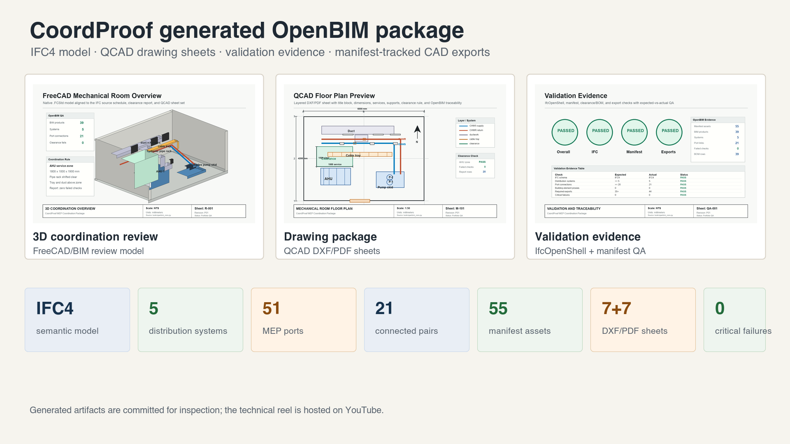
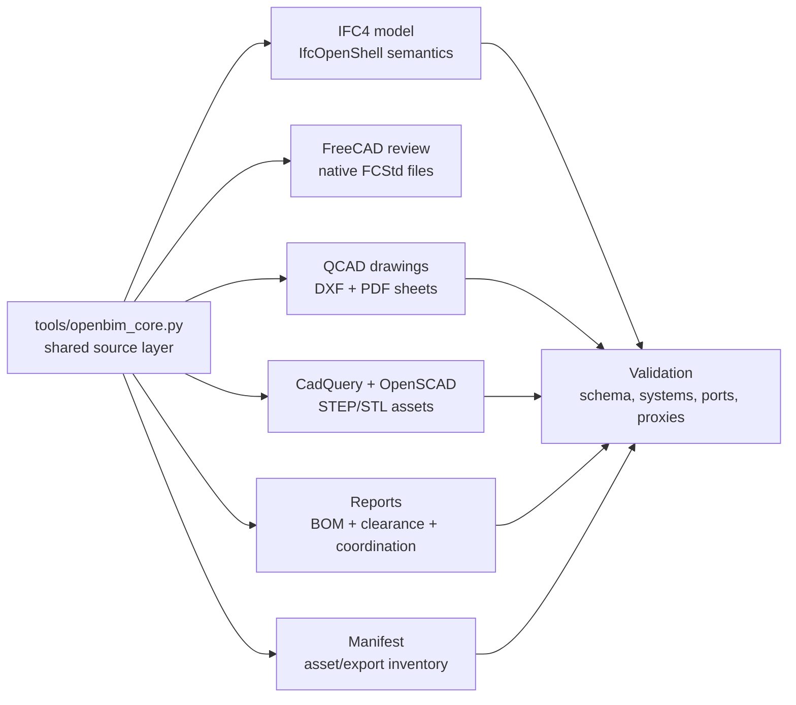
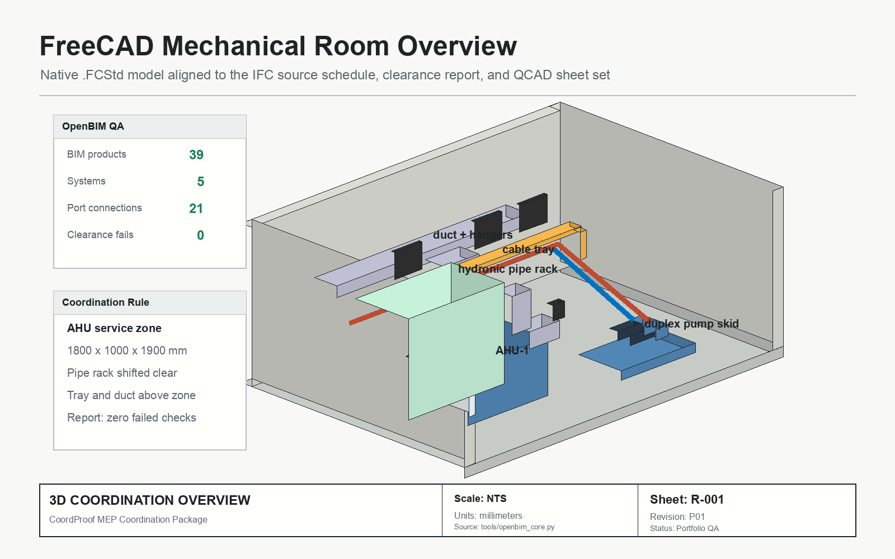
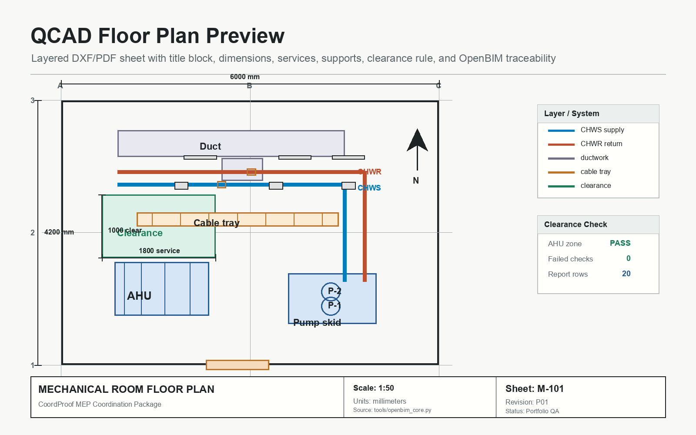
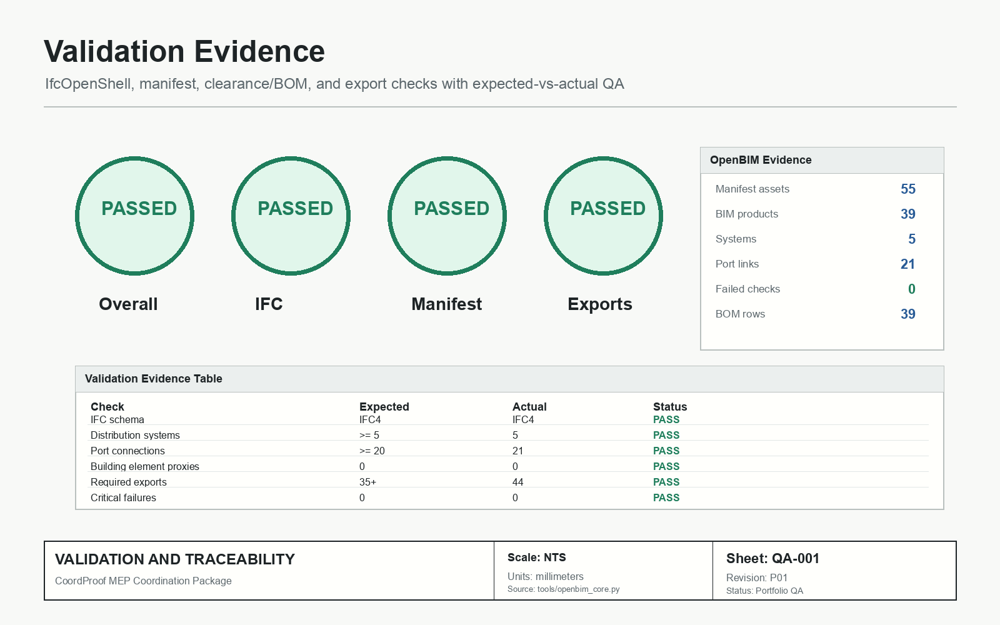
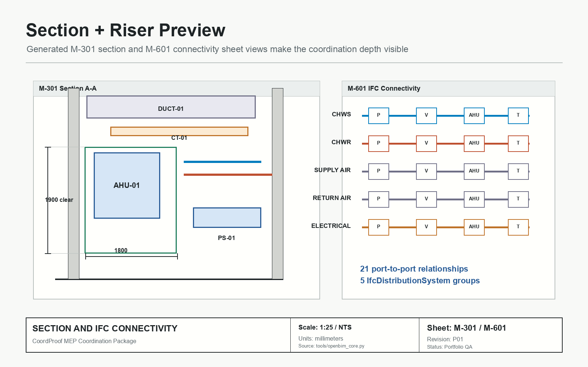
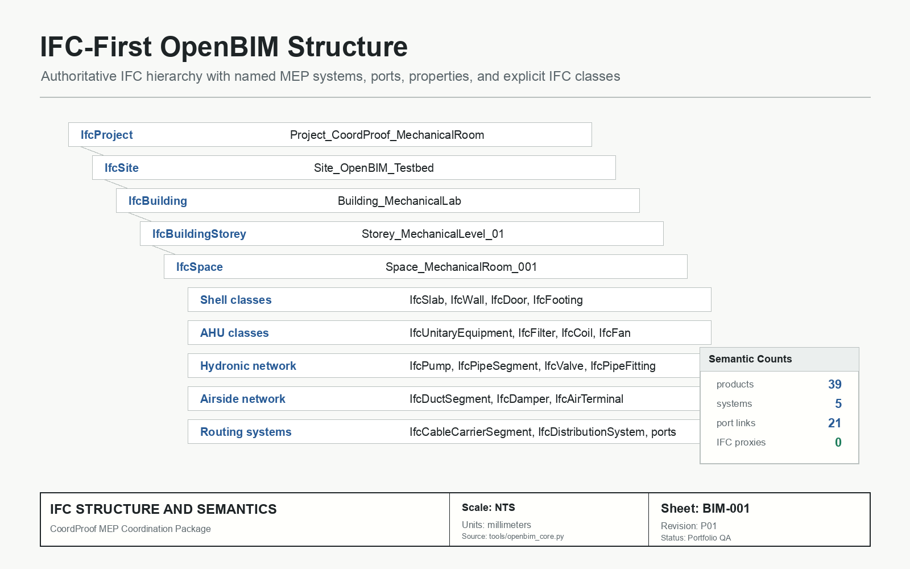
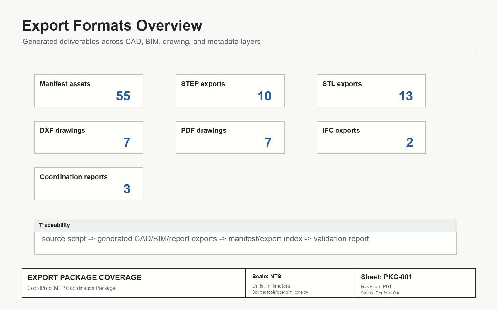

# CoordProof

**Reproducible OpenBIM evidence package for MEP coordination.**

CoordProof generates a coordinated mechanical-room package from a shared Python/OpenBIM source layer. The package includes IFC4 semantics, FreeCAD review models, QCAD DXF/PDF drawings, STEP/STL CAD exports, asset manifests, BOM/clearance reports, and automated validation.



## System

CoordProof models a mechanical room as a traceable CAD/BIM production package. Asset IDs, dimensions, locations, IFC classes, system membership, distribution ports, clearance zones, drawing annotations, exports, and validation rules are generated from shared source definitions.

The package connects geometry, drawings, IFC semantics, reports, and QA outputs as inspectable artifacts.

## Evidence Summary

| Output | Count | Purpose |
| --- | ---: | --- |
| IFC models | 2 | Authoritative semantic IFC plus supporting FreeCAD review export. |
| IFC products | 43 | Named BIM objects in the authoritative IFC model. |
| Distribution systems | 5 | CHWS, CHWR, supply air, return air, and electrical routing. |
| Distribution ports | 51 | MEP connectivity graph. |
| Connected port pairs | 21 | Machine-readable relationships between systems/assets. |
| Building element proxies | 0 | No generic proxy fallback in the authoritative validation model. |
| Manifest assets | 55 | Traceable asset inventory across 15 categories. |
| DXF/PDF sheets | 7 + 7 | QCAD drawing package and review exports. |
| STEP/STL exports | 10 + 13 | Reusable CAD assets and mesh review/export layer. |
| Critical validation failures | 0 | Current automated QA status. |

## Generated Package

| Package Layer | Generated Artifacts |
| --- | --- |
| OpenBIM model | IFC4 project/site/building/storey/space hierarchy, MEP classes, systems, ports, property sets, and semantic inventory. |
| CAD review model | FreeCAD assembly files and supporting FreeCAD BIM organization for native model inspection. |
| Drawing package | QCAD-ready DXF sheets with matching PDF exports, title blocks, dimensions, sections, details, and system routing views. |
| Asset library | CadQuery and OpenSCAD assets exported to STEP/STL for reusable mechanical supports, routing components, bases, sleeves, and details. |
| Reports | Coordination report, bill of materials, clash/clearance screen, IFC entity summary, and validation report. |
| QA manifest | Asset manifest and export index linking generated objects to categories, parameters, file outputs, and validation status. |

## Architecture



## Primary Artifacts

| Area | Files |
| --- | --- |
| Source layer | [`tools/openbim_core.py`](tools/openbim_core.py), [`tools/build_all.py`](tools/build_all.py) |
| IFC/OpenBIM | [`bim/mechanical_room.ifc`](bim/mechanical_room.ifc), [`bim/mechanical_room_freecad_review.ifc`](bim/mechanical_room_freecad_review.ifc), [`bim/openbim_semantic_inventory.csv`](bim/openbim_semantic_inventory.csv) |
| Drawings | [`qcad/`](qcad/), [`qcad/pdf_exports/`](qcad/pdf_exports/) |
| Assets | [`cadquery/`](cadquery/), [`openscad/`](openscad/), [`exports/`](exports/) |
| Reports | [`reports/coordination_report.md`](reports/coordination_report.md), [`reports/bill_of_materials.csv`](reports/bill_of_materials.csv), [`reports/clash_clearance_report.csv`](reports/clash_clearance_report.csv) |
| Validation | [`validation/validation_report.md`](validation/validation_report.md), [`tools/preflight_public_package.py`](tools/preflight_public_package.py) |

## Visual Outputs

| 3D coordination review | Drawing package | OpenBIM validation |
| --- | --- | --- |
|  |  |  |

| Section + IFC connectivity | BIM hierarchy | Asset/export coverage |
| --- | --- | --- |
|  |  |  |

## Validation

| Check | Expected | Actual | Status |
| --- | ---: | ---: | --- |
| IFC schema | IFC4 | IFC4 | PASS |
| Distribution systems | >= 5 | 5 | PASS |
| Port connections | >= 20 | 21 | PASS |
| Building element proxies | 0 | 0 | PASS |
| Required exports | 35+ | 44 | PASS |
| Critical failures | 0 | 0 | PASS |

Validation is implemented with IfcOpenShell inspection, manifest checks, export-count checks, and deterministic report generation. The generated report is available at [`validation/validation_report.md`](validation/validation_report.md).

## Reproduction

Install Python dependencies:

```bash
python3 -m venv .venv
.venv/bin/python -m pip install -r requirements.txt
```

Regenerate the package:

```bash
make all
```

Run validation and public-package preflight:

```bash
make validate
make preflight
```

Current validation status:

```text
Overall Status: PASSED
IFC Validation: PASSED
Manifest Validation: PASSED
Exports Validation: PASSED
```

## Engineering Scope

The implemented scope is CAD/BIM automation and OpenBIM package generation.

Excluded scopes: stamped engineering design, construction documents, manufacturer fabrication modeling, code compliance, hydraulic calculation, airflow calculation, and full clash-detection analysis.

Major objects are named, classified, exported, documented, mapped, coordinated, and validated from the same OpenBIM source layer. See [`docs/limitations.md`](docs/limitations.md) for detailed modeling assumptions and boundaries.

## Technical Reel

<p align="center">
  <a href="https://youtu.be/4Ww1gH0GFy8">
    
  </a>
</p>

<p align="center">
  <strong><a href="https://youtu.be/4Ww1gH0GFy8">Watch the CoordProof technical reel on YouTube</a></strong>
</p>
